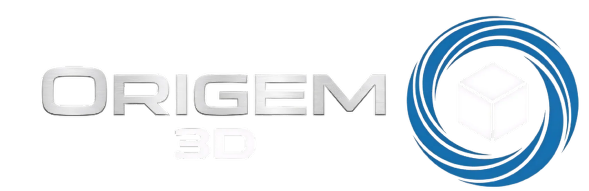
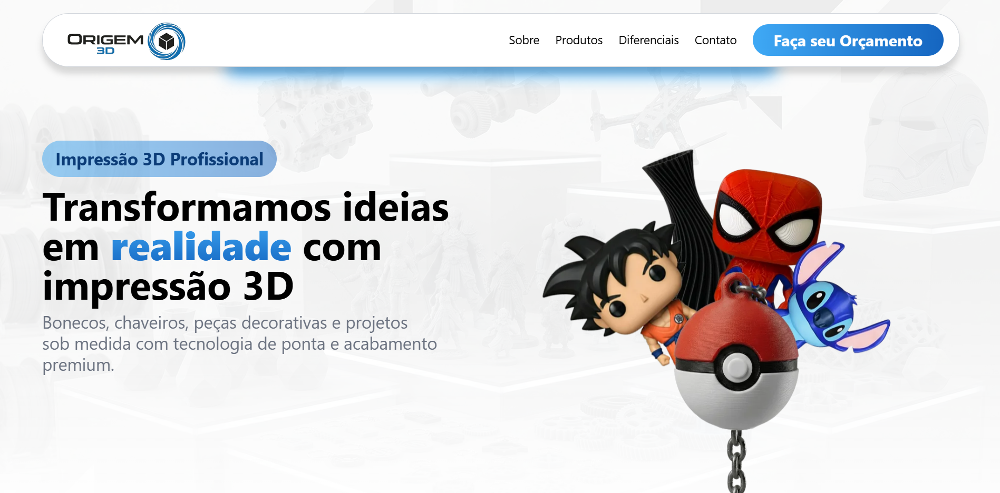

  <picture>
    <source media="(prefers-color-scheme: dark)" srcset="public/images/logo_branca_1.webp">
    <source media="(prefers-color-scheme: light)" srcset="public/images/logo_1.webp">
    
  </picture>

# 🧩 Origem 3D — Landing Page

Landing page desenvolvida para **Origem 3D**, um negócio focado na criação e venda de **produtos feitos com impressão 3D**, como peças decorativas, chaveiros, miniaturas e itens personalizados.

O objetivo do projeto é apresentar os produtos de forma moderna, clara e responsiva, facilitando o contato com clientes interessados em peças personalizadas.

## 🌐 Acesse o projeto

A aplicação pode ser acessada em:

🔗 **https://origem3d.rf.gd/**

> O link será atualizado quando o projeto estiver publicado.

## 🖼️ Preview

> Banner principal da página com destaque para produtos criados em impressão 3D.

## 📌 Tecnologias usadas

## ✨ Funcionalidades

A landing page possui:

* 🎨 Layout moderno e responsivo
* 📱 Compatível com desktop e mobile
* 🎞️ Animações ao aparecer na tela (scroll reveal)
* 🧩 Slider de categorias de produtos
* 📦 Destaque para diferentes tipos de itens impressos em 3D
* 📲 Botão de contato direto com WhatsApp
* 📷 Banner visual com produtos em destaque
